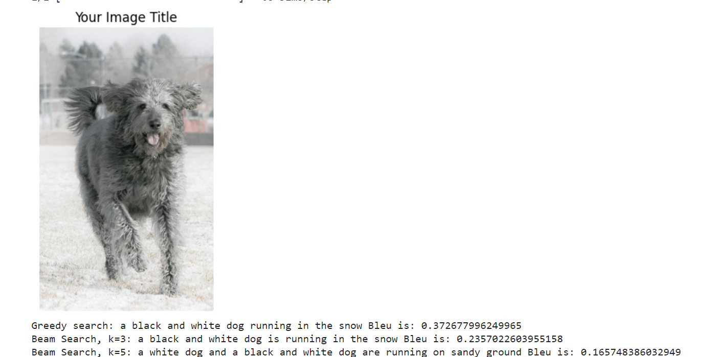
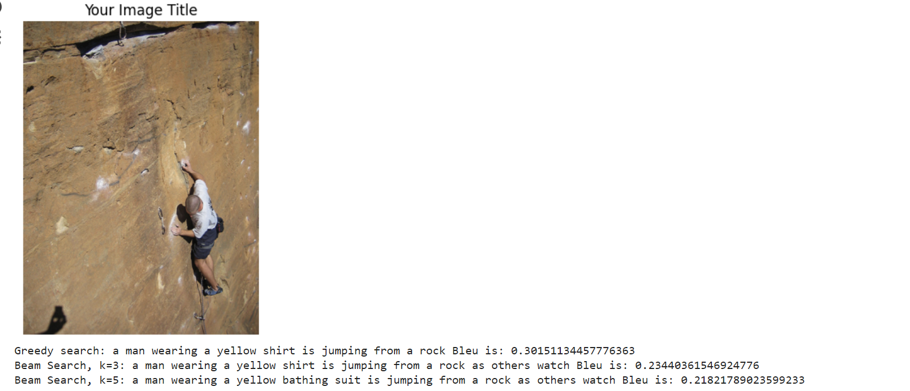
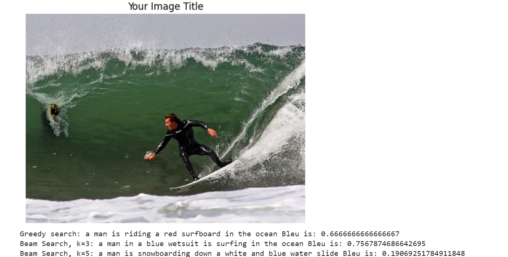
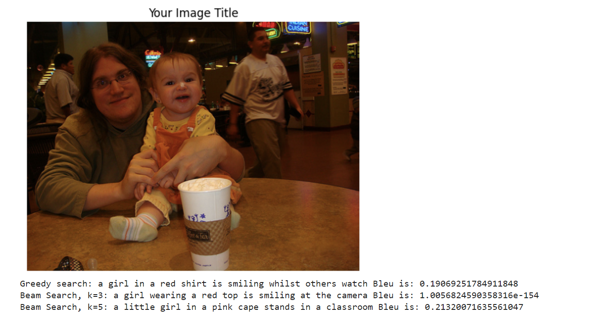
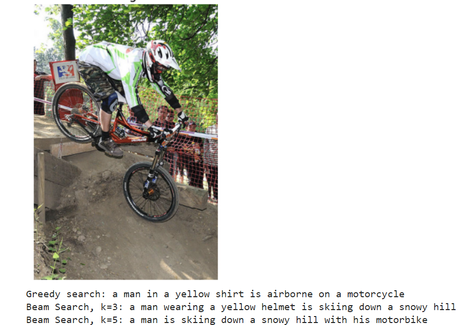

# Image Captioning Model
 **Problem Statement** 
 Image captioning is the task of generating relevant captions for the images that define the objects and actions being performed in the image. The goal is to enable machines to understand and articulate the content of images in natural language.
  **Applications**
 These models have valuable applications across various domains, particularly in enhancing accessibility for individuals with visual impairments. They play a significant role in tasks such as content indexing and retrieval, benefiting fields like e-commerce and digital asset management, where automatic tagging and categorization of images are essential.In the education and healthcare sectors, these models extract pertinent information from images, facilitating diagnoses and saving valuable time. Lastly, image captioning models contribute to content moderation on social media platforms by identifying and filtering inappropriate or harmful images as part of content moderation efforts.
  **Dataset**
 The Flickr8k dataset is a widely used benchmark dataset in the field of image captioning. It consists of 8,000 high-quality images sourced from the photo-sharing platform Flickr, each paired with five descriptive captions provided by human annotators. This dataset serves as a valuable resource for training and evaluating image captioning models, allowing researchers to develop algorithms that generate accurate and contextually relevant captions for a diverse range of visual content.
  **Architecture**
 We have used InceptionNetV3 pretrained on imagenet dataset to generate the features for our images. A bi-lstm model has been used to learning and predicting the captions.Bidirectional LSTMs process inputs in two directions once forward and once backward so they capture both past and future contexts of information and are able to capture long term dependencies in data and understand the relationship between different elements in a sequence even better than LSTMs.

  **Beam Search**
 Beam search is a search algorithm commonly used in natural language processing tasks, including image captioning. In the context of image captioning, the goal is to generate a descriptive caption for an image. Beam search is employed to find the most likely sequence of words that form a coherent and relevant caption.The purpose of beam search is to explore multiple possible captions and avoid getting stuck in suboptimal solutions. It helps balance the trade-off between exploration (considering diverse possibilities) and exploitation (focusing on the most promising candidates).
  **Results**
 CORPUS - BLEU-1: 0.435339
 CORPUS - BLEU-2: 0.247465
 CORPUS - BLEU-3: 0.166682
 CORPUS - BLEU-4: 0.080358
  

