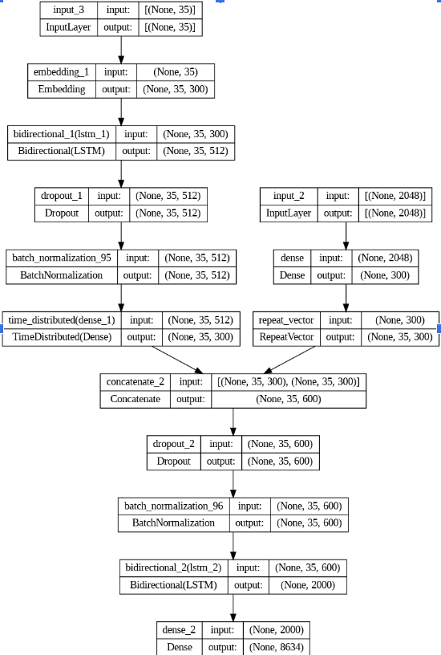

Bi-LSTM Code Base Structure :

 Preprocessing.py : Does all the preprocessing of the data which includes the helper methods required to clean captions, load image features and get the image ids from the annotations file. This also feeds data to the model while training. 
 bleu.py : Evaluation script that runs on the entire test dataset and calculates the BLEU scores.
 encoder.py : Extracts the features from the images in the dataset using the InceptionV3 with pretrained weights from Imagenet.
 models.py : The model architecture.

 test.py : Has the script to test the model on single images to get the predictions.
 train.py : Trains the model.
 image_captioning.py : The consolidated code , having all the code from the above files at a single place.
 The res folder consists of few test images and their predicted captions. Flickr folder has the saved image features for the flickr images. Due to file size restrictions on github we could not upload the final weights of the trained model.
