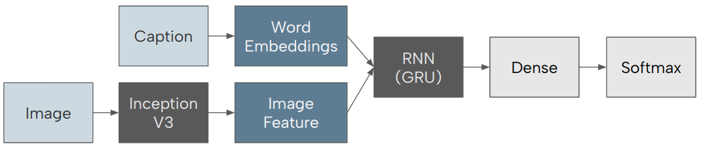
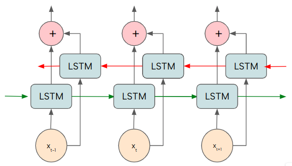
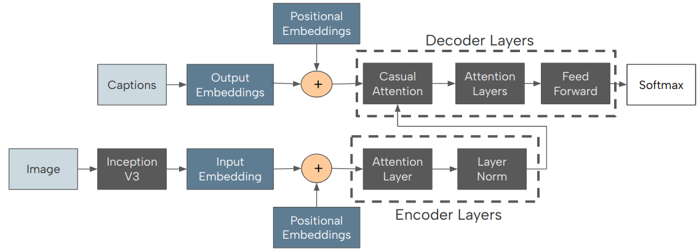
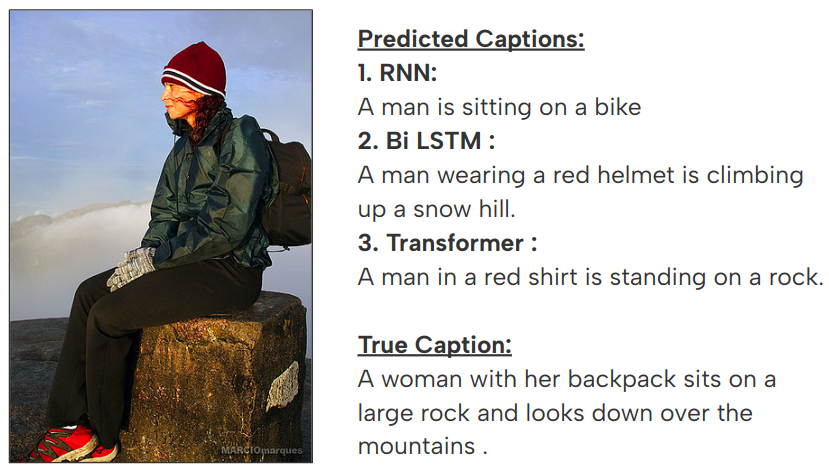
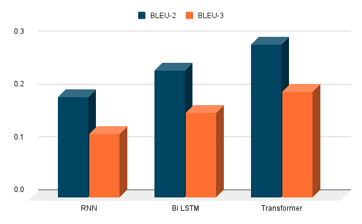

# Comparitive analysis of RNN's, BiLSTMS's and Transformers in image captioning.

Our aim is to study the different models that are available and are generally used for this task of image captioning. Conducting a comparative study and understanding different methods of image captioning serves several valuable purposes in the field of artificial intelligence and computer vision. A comparative study of image captioning methods is essential for guiding the selection of appropriate models for specific tasks, fostering innovation, and advancing the overall understanding of how different architectures perform in diverse scenarios.

## Dataset :

We chose to utilize the Flickr8k dataset in our study as it offers a diverse and comprehensive collection of around 8000 images, each accompanied by detailed captions. The dataset was selected for its representation of a wide array of scenes, objects, and concepts, making it well-suited for evaluating the performance of image captioning models across various real-world scenarios. By incorporating Flickr8k into our experimentation, we aimed to leverage its richness and diversity to thoroughly assess the generalization capabilities of the employed image captioning techniques. The availability of high-quality images with corresponding captions in the dataset facilitated the training, validation, and testing phases, allowing for a robust evaluation of the models’ performance on a
broad spectrum of visual content. 

## Methodology : 

We employed three different model architectures for image captioning:

### GRU in Recurrent Neural Networks

The GRU RNN model architecture for image captioning is structured to effectively combine visual and sequential information for accurate caption generation. The model takes two types of input: visual features extracted from images and sequential information from tokenized captions.

    

### BiDirectional LSTM

Bidirectional LSTMs process inputs in two directions once forward and once backward so they capture both past and future contexts of information and are able to capture long term dependencies in data and understand the relationship between different elements
in a sequence even better than LSTMs. The flow of information between each cell of LSTM is better depicted in the figure.

    

### Transformers

The encoder’s job is to process the input data—in this case, the embeddings of the image features—and generate a rich, context-aware representation. Each encoder layer consists of a self-attention mechanism followed by a feed-forward neural network.
The self-attention mechanism allows the encoder to weigh the importance of different parts of the input data differently, which is particularly useful for understanding complex inputs like images where certain features may be more relevant to the captioning task
than others. The decoder takes the encoder’s output and generates the prediction sequence, i.e., the caption. It also uses self-attention layers. The self-attention layers in the decoder are masked to ensure that the prediction for a given word can only depend on earlier words in the sequence.

    

## Results

    
  

In conclusion, our exploration of different image captioning models revealed nuanced performance dynamics. While the RNN demonstrated unexpected success in BLEU-1 scores, deeper analysis unveiled its proficiency in unigram precision. However, as n-gram complexity increased, the Transformer and BiLSTM reclaimed their expected positions, emphasizing the importance of evaluating models across various metrics. It is crucial to note that while BLEU scores provide a quantitative measure of model performance, they may not fully capture the nuanced quality of generated captions, as discussed in subsequent sections. Additionally, a noteworthy observation is the marginal improvement in scores achieved by the BiLSTM compared to the RNN, considering the considerably higher computational demands of the former. This raises questions about the practical trade-off between computation cost and incremental score gains.

You can read the full analysis with experimental setup [here.]([https://www.genome.gov/](https://github.com/therrshan/image-captioning/blob/main/Documentation/Report.pdf))

### Contributions

Team project completed for the course CS5100 at Northeastern University. 
**Members :** Darshan Rajopadhye, Kevin Heleodoro, Poornima Jaykumar Dharamdasani, Saumya Gupta 
(Contributions to this project are welcome. Please feel free to fork the repository, make your changes, and create a pull request.)

